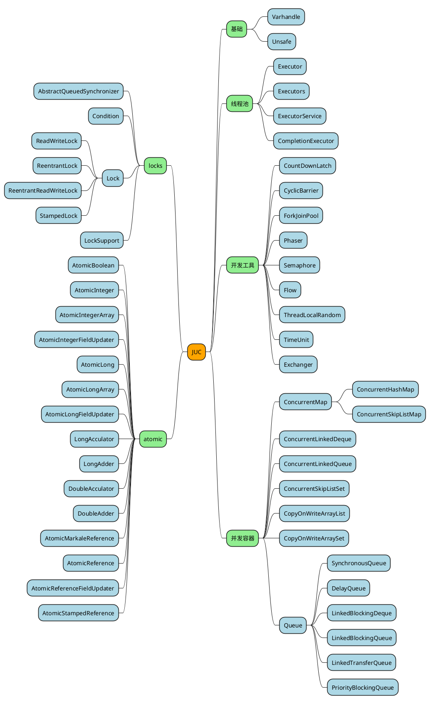

```plantuml
@startmindmap
*[#Orange] JUC
**[#lightgreen] 基础
***[#lightblue] Varhandle
***[#lightblue] Unsafe
**[#lightgreen] 线程池
***[#lightblue] Executor
***[#lightblue] Executors
***[#lightblue] ExecutorService
***[#lightblue] CompletionExecutor
**[#lightgreen] 开发工具
***[#lightblue] CountDownLatch
***[#lightblue] CyclicBarrier
***[#lightblue] ForkJoinPool
***[#lightblue] Phaser
***[#lightblue] Semaphore
***[#lightblue] Flow
***[#lightblue] ThreadLocalRandom
***[#lightblue] TimeUnit
***[#lightblue] Exchanger
**[#lightgreen] 并发容器
***[#lightblue] ConcurrentMap
****[#lightblue] ConcurrentHashMap
****[#lightblue] ConcurrentSkipListMap
***[#lightblue] ConcurrentLinkedDeque
***[#lightblue] ConcurrentLinkedQueue
***[#lightblue] ConcurrentSkipListSet
***[#lightblue] CopyOnWriteArrayList
***[#lightblue] CopyOnWriteArraySet
***[#lightblue] Queue
****[#lightblue] SynchronousQueue
****[#lightblue] DelayQueue
****[#lightblue] LinkedBlockingDeque
****[#lightblue] LinkedBlockingQueue
****[#lightblue] LinkedTransferQueue
****[#lightblue] PriorityBlockingQueue
left side
**[#lightgreen] locks
***[#lightblue] AbstractQueuedSynchronizer
***[#lightblue] Condition
***[#lightblue] Lock
****[#lightblue] ReadWriteLock
****[#lightblue] ReentrantLock
****[#lightblue] ReentrantReadWriteLock
****[#lightblue] StampedLock
***[#lightblue] LockSupport
**[#lightgreen] atomic
***[#lightblue] AtomicBoolean
***[#lightblue] AtomicInteger
***[#lightblue] AtomicIntegerArray
***[#lightblue] AtomicIntegerFieldUpdater
***[#lightblue] AtomicLong
***[#lightblue] AtomicLongArray
***[#lightblue] AtomicLongFieldUpdater
***[#lightblue] LongAcculator
***[#lightblue] LongAdder
***[#lightblue] DoubleAcculator
***[#lightblue] DoubleAdder
***[#lightblue] AtomicMarkaleReference
***[#lightblue] AtomicReference
***[#lightblue] AtomicReferenceFieldUpdater
***[#lightblue] AtomicStampedReference


@endmindmap
```