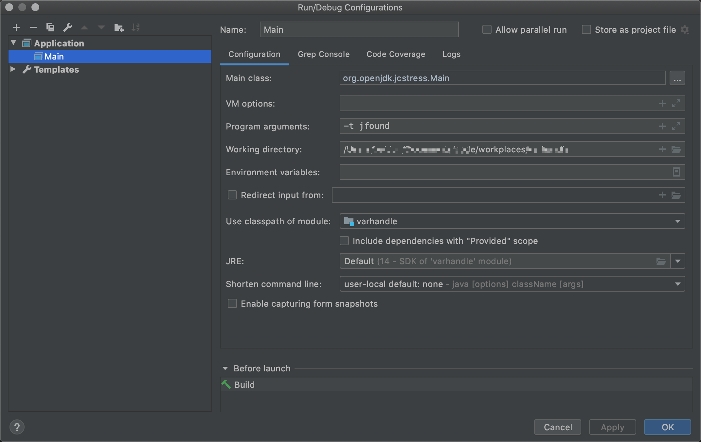
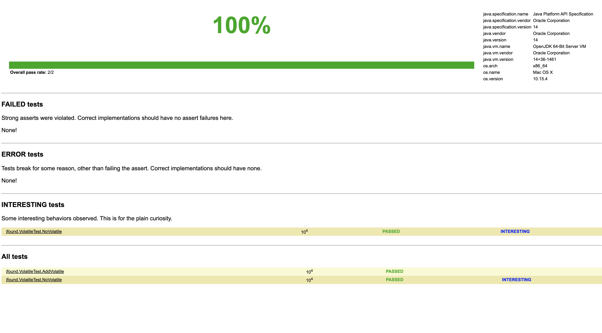
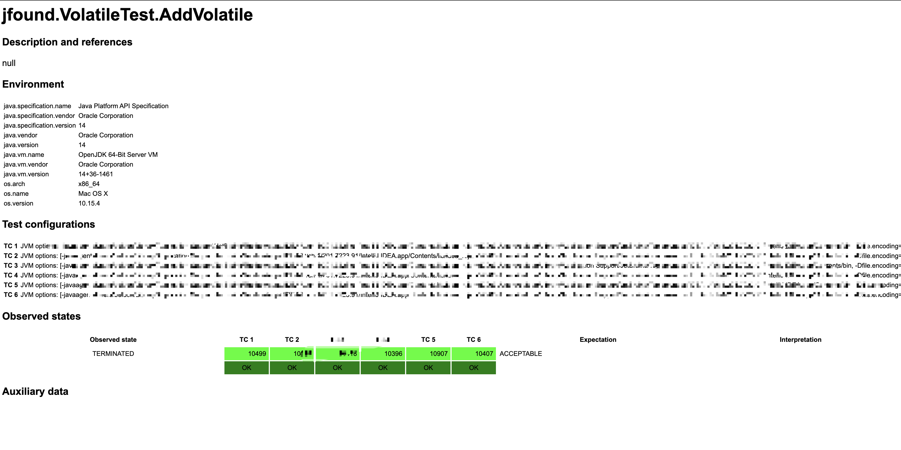

Jcstress 全称 Java Concurrency Stress，是一种并发压力测试工具，可以帮助研究JVM、java类库和硬件中并发的正确性。

Wiki地址：[https://wiki.openjdk.java.net/display/CodeTools/jcstress](https://wiki.openjdk.java.net/display/CodeTools/jcstress)

Wiki中有一个Jcstress的example，可以根据example很方便入门使用jcstress。当然，我们也可以手动创建自己的Jcstress测试工程。

<a name="46b96ab2"></a>
### Maven例子

添加maven依赖

```xml
<dependency>
    <groupId>org.openjdk.jcstress</groupId>
    <artifactId>jcstress-core</artifactId>
    <version>0.5</version>
</dependency>
<dependency>
    <groupId>org.openjdk.jcstress</groupId>
    <artifactId>jcstress-samples</artifactId>
    <version>0.5</version>
</dependency>
```

pom.xml 可以如下:

```xml
<?xml version="1.0" encoding="UTF-8"?>
<project xmlns="http://maven.apache.org/POM/4.0.0"
         xmlns:xsi="http://www.w3.org/2001/XMLSchema-instance"
         xsi:schemaLocation="http://maven.apache.org/POM/4.0.0 http://maven.apache.org/xsd/maven-4.0.0.xsd">
    <modelVersion>4.0.0</modelVersion>
    <groupId>jfound</groupId>
    <artifactId>jcstress-test</artifactId>
    <version>1.0.0-SNAPSHOT</version>
    <properties>
        <project.build.sourceEncoding>UTF-8</project.build.sourceEncoding>
    </properties>
    <dependencies>
        <dependency>
            <groupId>org.openjdk.jcstress</groupId>
            <artifactId>jcstress-core</artifactId>
            <version>0.5</version>
        </dependency>
        <dependency>
            <groupId>org.openjdk.jcstress</groupId>
            <artifactId>jcstress-samples</artifactId>
            <version>0.5</version>
        </dependency>
    </dependencies>
    <build>
        <plugins>
            <plugin>
                <groupId>org.apache.maven.plugins</groupId>
                <artifactId>maven-compiler-plugin</artifactId>
                <version>3.8.1</version>
                <configuration>
                    <source>11</source>
                    <target>11</target>
                </configuration>
            </plugin>
        </plugins>
    </build>
</project>
```

新增一个测试类，这次以测试变量加 `volatile` 和不加 `volatile` 的区别。代码如下：

```java
package demo;
import org.openjdk.jcstress.annotations.*;

public class VolatileTest {
    @JCStressTest(Mode.Termination)
    @Outcome(id = "TERMINATED", expect = Expect.ACCEPTABLE)
    @Outcome(id = "STALE", expect = Expect.ACCEPTABLE_INTERESTING)
    @State
    public static class NoVolatile {
        private int i = 0;

        @Actor
        public void actor() {
            while (i == 0) {
                //nothing
            }
        }
        @Signal
        public void single() {
            i = 1;
        }
    }
    @JCStressTest(Mode.Termination)
    @Outcome(id = "TERMINATED", expect = Expect.ACCEPTABLE)
    @Outcome(id = "STALE", expect = Expect.FORBIDDEN)
    @State
    public static class AddVolatile {
        private volatile int i = 0;
        @Actor
        public void actor() {
            while (i == 0) {
                //nothing
            }
        }
        @Signal
        public void single() {
            i = 1;
        }
    }
}
```

`VolatileTest` 类里面有两个静态内部类，其中 `NoVolatile` 的 **i** 是没有加 `volatile` 关键字的，`AddVolatile` 类中的 **i** 是有加 `volatile` 关键字的。

<a name="d136028a"></a>
#### 测试注解说明


- org.openjdk.jcstress.annotations.JCStressTest


该注解标记一个类为一个并发测试的类，有一个属性 value 为 `org.openjdk.jcstress.annotations.Mode`。`mode` 有**Continuous** 和 **Termination** 两种模式。**Continuous** 模式是运行几个 `org.openjdk.jcstress.annotations.Actor` 、`org.openjdk.jcstress.annotations.Ariter` 线程，并收集结果。**Termination** 模式运行具有阻塞/循环操作的单个 `Actor` 和 `Singal` 的测试。

- org.openjdk.jcstress.annotations.Outcome


`Outcome` 是描述测试结果，并处理这个结果，该注解有 **id**、**expect**、**desc**  这三个属性。
其中 id 接收结果，如上面的 **TERMINATED** 、 **STALE** 就是结果，id 还支持正则表达式；expect 是期望处理结果，类型为 `org.openjdk.jcstress.annotationsExpect` ，有 **ACCEPTABLE**、**ACCEPTABLE_INTERESTING** 、**FORBIDDEN**、**UNKNOWN** 四种类型，ACCEPTABLE 表示接受当前结果，ACCEPTABLE 结果不一定会存在；ACCEPTABLE_INTERESTING 和 ACCEPTABLE 差不多，唯一不一样的是，这个结果会在生成的报告中高亮；FORBIDDEN 表示永远不应该出现的结果，若测试过程中有该结果，意味着测试失败； UNKNOWN 没有评分，不使用。
如上面例子所示，一个测试类 (**JCStressTest**) 中可以有一个或多个 `Outcome` 。

- org.openjdk.jcstress.annotations.State


标记这个类是有状态的，有状态的意识是拥有数据，而且数据是可以被修改的，如上面测试例子中的 **i** , 其中 **i** 就是拥有的数据。为了方便理解，可以拿 Stateless 来做对比；如一些实体类是有状态(State)的，Service理应设置为无状态的 `Sateless` ，尽管service有属性，但是属性也是不能被修改的。
**`State` 修饰的类必须是 public 的，不能是内部类，但是可以是静态内部类，如上面例子。**
**`State` 修饰的类必须有一个默认构造函数**

- org.openjdk.jcstress.annotations.Actor


该注解标记的方法会被线程调用，被 **Actor** 修饰方法所在的类必须有 `State` 或者 `Result`注解，被其修饰的方法可以抛出异常，但是抛出异常的话，会引起测试失败。注意的是，**Actor 标记的每个方法仅由一个特定线程调用，而且每个被 State 标记的实例仅调用每一个方法** 。**Actor 修饰的方法之间是没有顺序的**，调用是并发执行的。
与之相对的还有 `org.openjdk.jcstress.annotations.Arbiter` 注解，`Arbiter` 注解和 `Actor` 注解差不多，不一样的是 `Arbiter` 注解声明的方法访问是在所有 `State` 之后，而且 `Actor` 所有的内存都对 `Arbiter` 可见，这就使得 `Arbiter` 在确认最终状态信息上有很大的作用。

- org.openjdk.jcstress.annotations.Singal


改注解在 `Termination` 模式下是比较有用的，它标记的方法执行是在 `Actor` 标记方法执行之后。

- org.openjdk.jcstress.annotations.Result


用该注解标记的类是测试结果的类，如 `org.openjdk.jcstress.infra.results` 下的类，该注解标记的类所有 field 都必须是原生数据类似或者是 String 类型，所有 field 都应该是 public。可以参考 `org.openjdk.jcstress.infra.results` 下的类。用法如下

```java
@Actor
public void actor1(I_Result r) {
    r.r1 = 1;
}
```

把测试结果用 `Result` 修饰的类接收，通常是配合 `toString` 打印出来。

- org.openjdk.jcstress.annotations.Description


与测试无关，可以定义一些描述，方便查看

- org.openjdk.jcstress.annotations.Ref


与测试无关，提供一些引用，如地址，ISBN等等。

- org.openjdk.jcstress.annotations.JCStressMeta


`Description` 、`Outcome`、`Ref` 这些注解是可以放到一个公共类，然后由 **JCStressMeta** 注解引进来，以达到重复使用的目的。

<a name="a2e5313a"></a>
### 运行及结果说明

在idea下执行如下其中 `Main class` 填写 `org.org.openjdk.jcstress.Main` , 参数中的 `-t` 是指指定测试包名，不指定的话是默认扫描项目所有包。在执行完成后，会在项目所在的目录下生成 `results` 文件夹，里面有个 `index.html` ，用浏览器打开即可查看报告。



### 总结

本文以一个例子展开来编写 **Jcstress** 并发测试工具的使用说明，并描述了 Jcstress 的所有核心注解，方便初学者去了解并借助该工具来学习并发编程。
