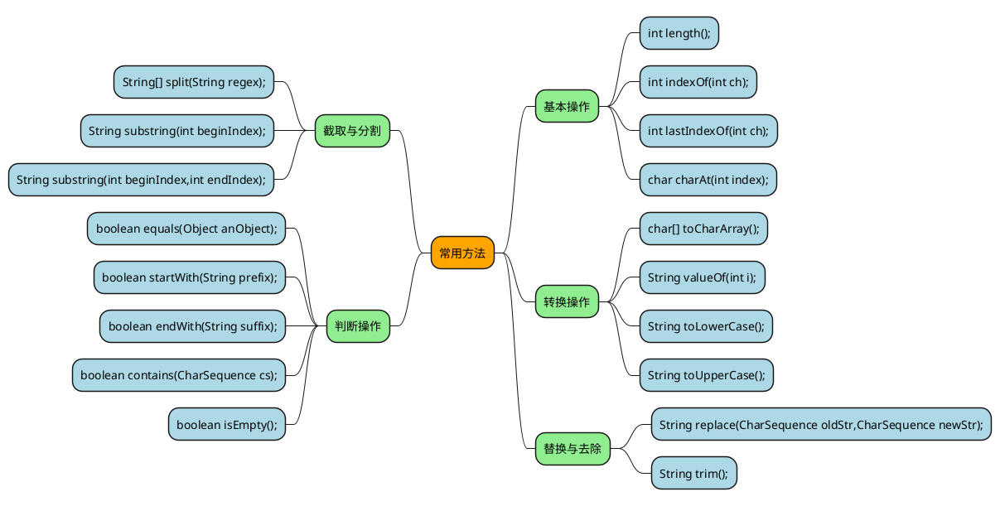
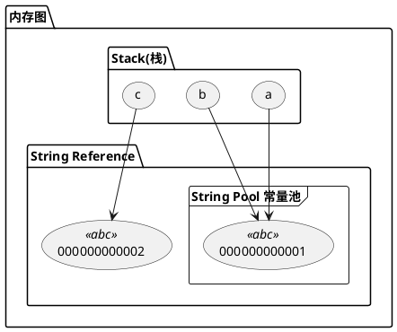

## 概述

在 Java 8 中，String 内部使用 char 数组存储数据。

```java
public final class String
    implements java.io.Serializable, Comparable<String>, CharSequence {
    /** The value is used for character storage. */
    private final char value[];
}
```

在 Java 9 之后，String 类的实现改用 byte 数组存储字符串，并使用 `coder` 来标识使用了哪种编码。

```java
public final class String
    implements java.io.Serializable, Comparable<String>, CharSequence {
    /** The value is used for character storage. */
    private final byte[] value;

    /** The identifier of the encoding used to encode the bytes in {@code value}. */
    private final byte coder;
}
```

value 数组被声明为 final，这意味着 value 数组初始化之后就不能再引用其它数组。并且 String 内部没有改变 value 数组的方法，因此可以保证 String 不可变。

- 常用方法



## String 的不可变性

String 的源码注释中，有以下一句话。
```text
Strings are constant; their values cannot be changed after they are created
```

意思是 String 一创建后就不可改变的了。

String 不变的好处 

- 可实现多个变量引用堆内存中的同一个字符串实例，避免重复创建增加开销。
- 缓存 hashcode，使用 String 作为 HashMap 的 key 时候，效率大大提升 
- 多线程安全，由于 String 是不可变对象，可以自由在多个线程之间共享对象，不需要同步处理。
- String Pool 的需要。

## 字符串常量池

> [!NOTE]
> 在 Java 7 之前，String Pool 被放在运行时常量池中，它属于永久代。而在 Java 7，String Pool 被移到堆中。这是因为永久代的空间有限，在大量使用字符串的场景下会导致 OutOfMemoryError 错误。

- 一经典面试题
```java
public class StringDemo {
    public static void main(String[] args) {
        String a = "abc";
        String b = "abc";
        String c = new String("abc");
        System.out.println(a==b);  //true
		System.out.println(a == c.intern()); //true
        System.out.println(a.equals(b));  //true
        System.out.println(a==c);  //false
        System.out.println(a.equals(c));  //true
    }
}
```

> [!TIP]
> new String("abc") 创建了两个对象，"abc" 属于字符串字面量，因此会在 String Pool 中创建一个对象，使用 new 关键字又会在堆里面创建一个新的 String 对象。



> [!NOTE]
> 当一个字符串调用 intern() 方法时，如果 String Pool 中已经存在一个字符串和该字符串值相等（使用 equals() 方法进行确定），那么就会返回 String Pool 中字符串的引用；
> 否则，就会在 String Pool 中添加一个新的字符串，并返回这个新字符串的引用。

由于 String 是很常用，String 在设计的时候做了优化，每次生成一个新的字符串时（用 = 设置或者调用 intern() 方法），都会添加到一个共享池中，当第二次
生成同样的字符串实例时，就共享此对象，而不是创建一个新的对象。

需要注意的是，在 Object 对象， equals() 是用来比较内存地址的，相当于 **==** 比较，但是 String 重写了 equals 方法，用来比较内容时，即使内存地址不一致，只要内容一直，都是返回true。

> [!DANGER]
> **做字符串对比时用 equals， 避免使用 ==**


## String 、StringBuilder、StringBuffer

**1.可变性**
- String 不可变
- StringBuffer 和 StringBuilder 可变

**2. 线程安全**
- String 不可变，因此是线程安全的
- StringBuilder 不是线程安全的
- StringBuffer 是线程安全的，内部使用 synchronized 进行同步

> [!TIP]
> 在使用字符串拼接时，尽量使用 StringBuilder 、StringBuffer，避免使用 String 拼接时产生比较多的临时的字符串。
> 由于 StringBuilder 是线性不安全的，效率会明显比 StringBuffer 高，所以在线性安全的环境下，尽量使用 StringBuilder。

