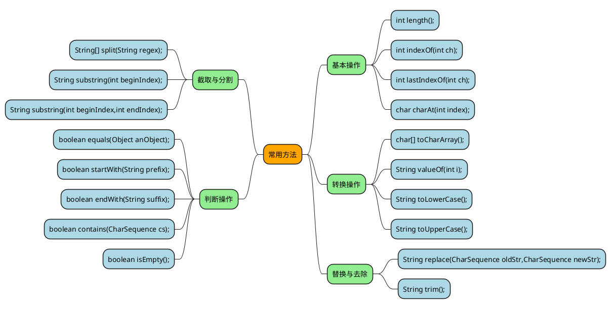

## 概述

在 Java 8 中，String 内部使用 char 数组存储数据。

```java
public final class String
    implements java.io.Serializable, Comparable<String>, CharSequence {
    /** The value is used for character storage. */
    private final char value[];
}
```

在 Java 9 之后，String 类的实现改用 byte 数组存储字符串，并使用 `coder` 来标识使用了哪种编码。

```java
public final class String
    implements java.io.Serializable, Comparable<String>, CharSequence {
    /** The value is used for character storage. */
    private final byte[] value;

    /** The identifier of the encoding used to encode the bytes in {@code value}. */
    private final byte coder;
}
```

value 数组被声明为 final，这意味着 value 数组初始化之后就不能再引用其它数组。并且 String 内部没有改变 value 数组的方法，因此可以保证 String 不可变。

[7689974](https://www.cnblogs.com/zhangyinhua/p/7689974.html)

- 常用方法



## 字符串常量池

```java
String a1 = new String("a");
System.out.println(a1 == a1.intern()); //false
String a = "a";
System.out.println(a == a1); //false
System.out.println(a == a1.intern()); //true
```


## String 、StringBuilder、StringBuffer


