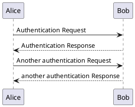
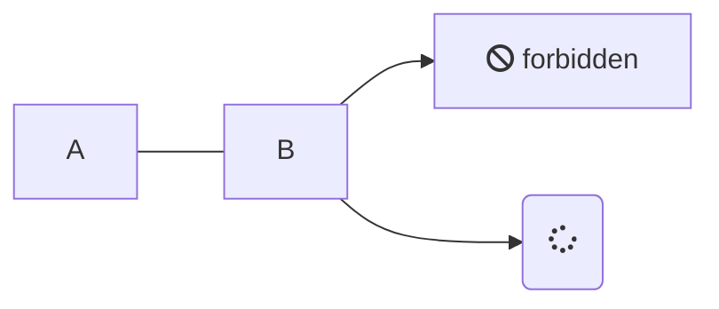

> [!NOTE]
> An alert of type 'note' using global style 'callout'.

> [!TIP]
> An alert of type 'tip' using global style 'callout'.

> [!WARNING]
> An alert of type 'warning' using global style 'callout'.

> [!DANGER]
> An alert of type 'danger' using global style 'callout'.

<!-- tabs:start -->

#### ** Dev **

Dev!

#### ** Ops **

Ops!

<!-- tabs:end -->

## plantuml
[plantuml](https://plantuml.com/)

## mermaid

